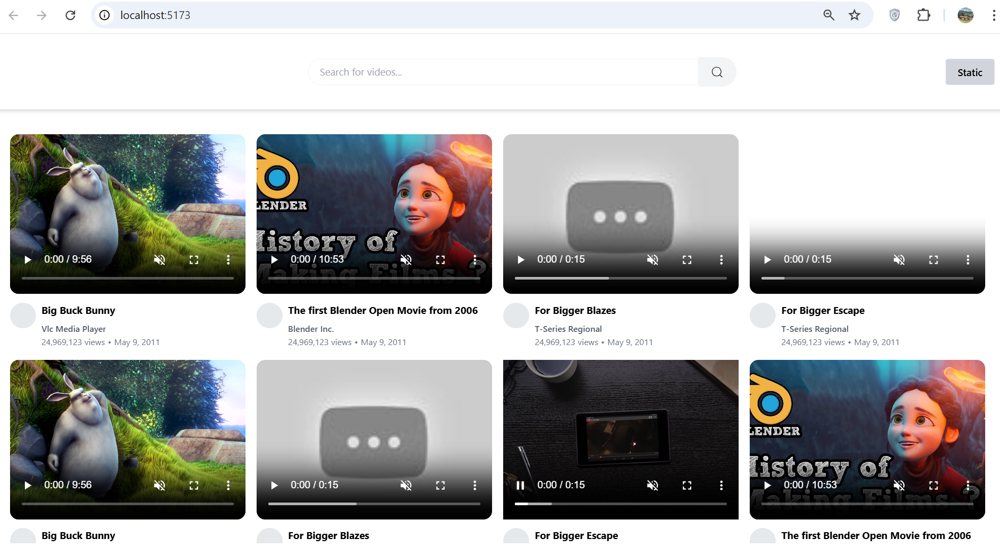

## VStream

This project is a simplified YouTube-like application that allows users to view video previews, titles, authors, views, and upload dates. The app is built with **React + Vite + TypeScript** on the frontend and **Laravel** on the backend.

## Tech Stack

- **Frontend:** React, Vite, TypeScript, Jest
- **Backend:** Laravel 12, REST API
- **Testing:** Jest (Unit Testing)

## Implementation Notes

1. **API Consumption:** Frontend makes HTTP requests to Laravel backend using Axios.

2. **Video Cards:** Each video card displays preview, title, author, views, and posted date.

3. **Component Design:** Video UI elements (mute button, progress bar, etc.) are split into modular components.

4. **Search Feature:** Home screen includes a live search filtering by title or description.

5. **CORS:** Make sure the backend allows requests from your frontend dev server (usually http://localhost:5173).

6. **Video Preview Modes:** The VideoPreview component supports two modes, controlled via the mode prop:

        Interactive: Autoplay with hover effects and progress.

        Static: Displays only the thumbnail image with no interactivity.

##  Prerequisites

Before setting up the project, make sure the following tools are installed on your machine:

- **PHP** >= 8.1
- **Composer** 
- **MySQL** 
- **Node.js & npm** 
- **Git** 

## Configure Environment Variables

- **open your .env file and update it with your database and other environment settings. Make sure the following values are correctly set**

DB_CONNECTION=mysql
DB_HOST=127.0.0.1
DB_PORT=3306
DB_DATABASE=your_database_name
DB_USERNAME=your_database_username
DB_PASSWORD=your_database_password

##  Getting Started

### Clone the Repository
```bash
git clone https://github.com/your-username/your-laravel-project.git
cd youtube-be

## Install PHP Dependencies

composer install

## Migrate the databse

**Refresh Laravel Configuration and Cache:**

php artisan config:cache  
php artisan cache:clear

**Apply Database Migrations:**

php artisan migrate

**Seed the Database**

php artisan db:seed

## Start the Development Server

php artisan serve

## Screenshots

